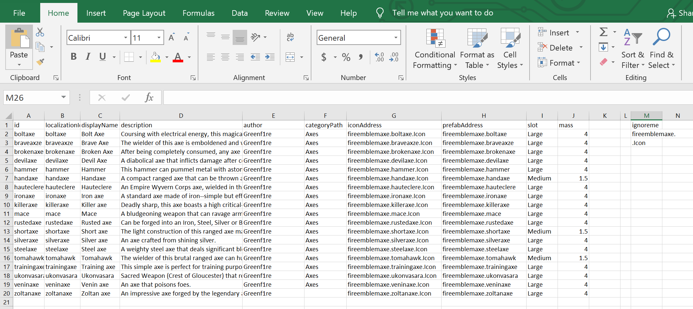

# BaS-Modding-Tools
This tool makes it easier for mod makers to keep a database of their mod json. 
## Requirements and installation
-Requires Python 3.6
1. Download Zip or clone via git
2. extract main.py
## Preparation

Ceate a spreadsheet in excel with the headers id, localizationId,	displayName,	description,	author,	categoryPath,	iconAddress,	prefabAddress,	slot,	mass
These are the fields that will be changed in the json

Each row is a separate item. For example, 19 rows of items will create 19 different json. Fill out the information in each column.

The template json may be anything from the default game or from mods. For my example, all of my weapons are axes so I'll choose one of  the default axe json from the game. The parser will then take the template and apply the values from the csv database.
## Usage
1. On windows, open powershell/cmd in the install directory
2. Type `py -3 .\main.py "template.json" "database.csv" "output directory (optional)"`
3. If the output directory is blank, the weapon jsons will be generated in the current directory.

## Credits
Written by [Crimson1ce](https://github.com/Crimson1ce)
